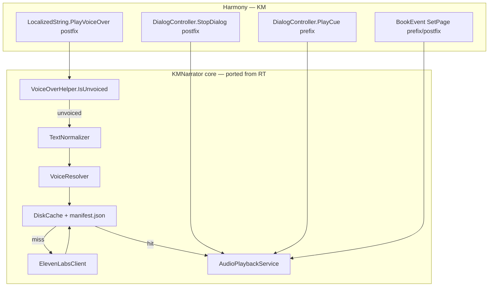

# KMNarrator — execution plan

ElevenLabs-powered voice for **unvoiced** *Pathfinder: Kingmaker* dialogue, delivered as a **Unity Mod Manager** Harmony mod with a **shareable on-disk MP3 cache**.

**Status:** v0.1.0 — see [progress.json](./progress.json).

**Source mod:** [RT Narrator](../RTVoiceMod) at **v0.1.0** (ElevenLabs only; Kokoro/local TTS stashed — not in scope here).

**Reference:** `reference/Kingmaker/Assembly-CSharp/` (dnSpy export).

---

## Goals (v0.1)

1. When the game would play **no** Wwise VO for a line, synthesize via ElevenLabs and play in-game.
2. **Cache** MP3s by content hash under `{ModFolder}/cache/` (shareable).
3. **Configurable:** API key, default voice, model, speed, volume, per-character voice map.
4. **Toggles:** only unvoiced lines, stage directions, book events, barks (barks off by default).

## Non-goals (v0.1)

- Kokoro / local TTS sidecar (future; RT has this stashed separately)
- Replacing official Wwise VO
- Wwise sound bank injection
- Lip sync
- `SpaceEventVM` hooks (RT-only; no KM equivalent)
- Achievements with mods enabled

---

## RT Narrator baseline (current git state)

What we port from `../RTVoiceMod/src/RTNarrator/`:

| Area | RT files | KM changes |
|------|----------|------------|
| Entry | `Main.cs` | Rename namespace; log prefix `[KMNarrator]` |
| Settings | `Settings.cs`, `ElevenLabsDefaults.cs` | Drop `EnableSpaceEvents`; keep book/barks toggles |
| UI | `UI/SettingsGui.cs` | Remove space-events toggle; rename labels |
| TTS | `ElevenLabs/*`, `Voice/CachedSpeechService.cs` | Direct copy |
| Cache | `Cache/*` | Fix `GameLocale` (KM uses static `LocalizationManager.CurrentLocale`) |
| Audio | `Audio/*` | Copy; verify NAudio works in KM (likely yes) |
| Voice | `Voice/Narrator.cs`, `TextNormalizer.cs`, `VoiceResolver.cs` | Fix unvoiced check + speaker helpers |
| Patches | `Patches/*`, `ModHarmony.cs` | **Rewrite** for KM types (see below) |

RT patch surface (do **not** copy verbatim):

- `VoiceOverPlayerPatch` → KM: `LocalizedString.PlayVoiceOver` postfix (dialog + barks)
- `SoundStatePatch` → KM: `DialogController.PlayCue` prefix + `StopDialog` postfix
- `SpaceEventVMPatch` → drop
- `BookEventVMPatch` → KM: `BookEventVM` + `BookEventBaseController.SetPage` hooks
- `BarkPlayerPatch` → covered by `PlayVoiceOver` when `VoiceSurface` = bark

---

## Kingmaker vs Rogue Trader

| Area | Rogue Trader | Kingmaker |
|------|--------------|-----------|
| Game assembly | `Code.dll` + `RogueTrader.GameCore.dll` | **`Assembly-CSharp.dll`** |
| .NET (game) | 4.8 | **4.0** (mod can target **net472**+) |
| VO entry | `VoiceOverPlayer.PlayVoiceOver(LocalizedString, GameObject)` | **`LocalizedString.PlayVoiceOver(MonoBehaviour)`** |
| Unvoiced check | `text.GetVoiceOverSound()` empty | **`LocalizationManager.SoundPack.GetText(key)` empty** |
| Stop TTS | `SoundState.StopDialog` (in `PlayCue`) | **`DialogController.PlayCue` prefix** + `StopDialog` postfix |
| Speaker hint | `Game.Instance.DialogController.CurrentSpeaker.CharacterName` | **Same** |
| Stage directions | `BlueprintCue.IsNarratorText` | **Not on KM `BlueprintCue`** — `{n}…{/n}` markup only via `TextNormalizer` |
| Locale | `LocalizationManager.Instance.CurrentLocale` | **`LocalizationManager.CurrentLocale`** (static) |
| UMM | Built into game | `Managed\UnityModManager\` |
| Mod folder | `%LocalLow%\...\UnityModManager\RTNarrator\` | **`Mods\KMNarrator\`** |
| UMM `ManagerVersion` | `0.25.0` | **`0.22.0`** (from BagOfTricks) |

### Confirmed call sites (`reference/Kingmaker/Assembly-CSharp`)

All paths funnel through `LocalizedString.PlayVoiceOver`:

| Caller | File |
|--------|------|
| PC dialog | `Kingmaker/UI/Dialog/DialogController.cs` → `data.Cue.Text.PlayVoiceOver(null)` |
| Console dialog | `Kingmaker/UI/_ConsoleUI/Dialog/DialogVM.cs` |
| Book events (console) | `Kingmaker/UI/_ConsoleUI/Dialog/BookEvent/BookEventVM.cs` (queue + `OnUpdate`) |
| Book events (PC) | `Kingmaker/UI/BookEvent/BookEventBaseController.cs` |
| Barks | `Kingmaker/UI/UIAccess.cs` → `text.PlayVoiceOver(entity?.View)` |

---

## Architecture



### Patch design

**1. `LocalizedStringPlayVoiceOverPatch` (postfix)**

```csharp
// Kingmaker.Localization.LocalizedString.PlayVoiceOver(MonoBehaviour target)
// After original runs:
//   if Settings.OnlyUnvoicedLines && !VoiceOverHelper.IsUnvoiced(__instance) → return
//   if __result != null → official VO playing → return
//   Narrator.Speak(__instance, speakerHint, surfaceTag)
```

Add a **transpiler or prefix guard** to avoid double-narration if we later add book-event batch hooks.

**2. `DialogControllerStopDialogPatch` (postfix)**

```csharp
// Kingmaker.Controllers.Dialog.DialogController.StopDialog()
// → AudioPlaybackService.Instance.Stop("StopDialog")
```

**3. Book events (Phase 4 — only if playtest fails)**

If unvoiced book pages skip lines because the game's queue drains faster than TTS enqueues, add postfix on:

- `Kingmaker.UI._ConsoleUI.Dialog.BookEvent.BookEventVM.SetVoiceCues`
- and/or `Kingmaker.UI.BookEvent.BookEventBaseController` equivalent

Mirror RT's `BookEventVMPatch` pattern.

**4. Barks**

Gated by `Settings.EnableBarks`. The `PlayVoiceOver` postfix covers `UIAccess.Bark`; no separate bark patch unless we need to suppress during active dialog.

### `VoiceOverHelper` (new — KM-specific)

```csharp
internal static bool IsUnvoiced(LocalizedString text)
{
    // Mirror LocalizedString.PlayVoiceOver lines 99–108:
    // SoundPack.GetText(resolvedKey, false) is null/empty
}
```

---

## Dependencies

| Dependency | Notes |
|------------|-------|
| UMM + Harmony | Reference from `Kingmaker_Data\Managed\UnityModManager\` |
| `Assembly-CSharp.dll` | `GameManagedPath` |
| `Newtonsoft.Json.dll` | In game Managed |
| NAudio + NLayer | Vendored in `lib/` (copy from RTVoiceMod) |
| ElevenLabs API key | User settings only — never commit |

**Do not bundle** Harmony or UMM in the release mod folder.

---

## Project layout

```
KingmakerNarrator/
  KMNarrator.sln
  Directory.Build.props
  lib/                          # UMM, NAudio, NLayer
  src/KMNarrator/
    Main.cs
    ModHarmony.cs
    Settings.cs
    VoiceOverHelper.cs          # KM-only
    Patches/
      LocalizedStringPlayVoiceOverPatch.cs
      DialogControllerStopDialogPatch.cs
    Voice/
    ElevenLabs/
    Cache/
    Audio/
    UI/
  deploy/KMNarrator/
    Info.json
    KMNarrator.dll
    cache/.gitkeep
  reference/Kingmaker/          # gitignored decompile
  docs/plans/
```

### `Info.json` (initial)

```json
{
  "Id": "KMNarrator",
  "DisplayName": "KM Narrator",
  "Author": "Marius Bjercke",
  "Version": "0.1.0",
  "ManagerVersion": "0.22.0",
  "GameVersion": "2.1.7b",
  "AssemblyName": "KMNarrator.dll",
  "EntryMethod": "KMNarrator.Main.Load"
}
```

> Confirm `GameVersion` against your install. `ManagerVersion` matches BagOfTricks / your UMM build.

---

## Phases

### Phase 0 — Toolchain & empty mod

| ID | Task | Acceptance |
|----|------|------------|
| 0.1 | `Directory.Build.props` + `lib/` from RTVoiceMod | Builds against KM Managed |
| 0.2 | `KMNarrator.csproj` — `net48`, refs `Assembly-CSharp`, UMM, Harmony, Unity modules | `dotnet build` succeeds |
| 0.3 | `Main.cs` stub + `deploy/KMNarrator/Info.json` | Mod listed in UMM, log on load |
| 0.4 | Deploy to `Mods\KMNarrator\` | Toggle on without errors |

---

### Phase 1 — Port ElevenLabs core (no dialogue hooks)

| ID | Task | Acceptance |
|----|------|------------|
| 1.1 | Copy `ElevenLabs/`, `Cache/`, `Audio/`, `ElevenLabsDefaults.cs` | Compiles |
| 1.2 | Copy `Settings.cs`, `SettingsGui.cs` — strip space-events UI | Settings persist |
| 1.3 | Copy `Voice/CachedSpeechService.cs`, `VoiceResolver.cs`, `TextNormalizer.cs` | Compiles |
| 1.4 | Fix `GameLocale` for KM static `LocalizationManager` | Locale subfolders work |
| 1.5 | Wire Test synthesis in UMM UI | Hear test line in-game |

---

### Phase 2 — KM voice helpers + Narrator

| ID | Task | Acceptance |
|----|------|------------|
| 2.1 | `VoiceOverHelper.IsUnvoiced` | Matches game behavior for empty SoundPack entries |
| 2.2 | `Narrator.Speak(LocalizedString, …)` — port from RT, use helper | Skips voiced when `OnlyUnvoicedLines` |
| 2.3 | `TryGetDialogSpeakerHint()` → `Game.Instance.DialogController.CurrentSpeaker.CharacterName` | Logs speaker in verbose mode |

---

### Phase 3 — Harmony MVP (core dialog)

| ID | Task | Acceptance |
|----|------|------------|
| 3.1 | `ModHarmony.cs` — manual patches only | No `PatchAll` |
| 3.2 | `LocalizedString.PlayVoiceOver` postfix | Unvoiced NPC line speaks |
| 3.3 | `DialogController.StopDialog` postfix | TTS stops on cue advance |
| 3.4 | Guards: mod disabled, no API key, empty text | No crash; log warning |

**Playtest:** standard surface dialog with a known unvoiced line; replay hits cache.

---

### Phase 4 — Extended surfaces

| ID | Task | Acceptance |
|----|------|------------|
| 4.1 | Book events — playtest with `EnableBookEvents` | Book page lines narrate |
| 4.2 | If 4.1 fails → `BookEventVM.SetVoiceCues` / `BookEventBaseController` hook | All page cues queued |
| 4.3 | Barks with `EnableBarks` (default off) | Ambient bark narrates when enabled |
| 4.4 | Drop `IncludeStageDirections` cue-flag path; keep `{n}` tag stripping only | No crash on narrator markup |

---

### Phase 5 — Polish & release

| ID | Task | Acceptance |
|----|------|------------|
| 5.1 | README install/config/cache sharing | Matches RT quality |
| 5.2 | `publish.ps1` or build script | Zip `KMNarrator-v0.1.0.zip` |
| 5.3 | Consistent `[KMNarrator]` log prefix | Grep-clean |
| 5.4 | API error hardening | No game crash on 401/429 |

---

## Configuration defaults

| Setting | Default |
|---------|---------|
| `OnlyUnvoicedLines` | `true` |
| `DefaultVoiceId` | ElevenLabs Rachel placeholder |
| `ModelId` | `eleven_flash_v2_5` |
| `EnableBookEvents` | `true` |
| `EnableBarks` | `false` |
| `IncludeStageDirections` | `true` |
| `VerboseLogging` | `false` |

---

## Risk register

| Risk | Mitigation |
|------|------------|
| KM API differs from RT reference | Use `reference/Kingmaker/` as source of truth |
| Unity audio works in KM but RT needed NAudio | Keep NAudio path from RT; it's proven |
| Book queue drains before TTS enqueues | Phase 4.2 fallback hooks |
| .NET 4.0 game vs mod TFM | Target `net472`; avoid C# features needing net48+ |
| `LocalizationManager.CurrentLocale` static API | Update `GameLocale` in Phase 1.4 |
| Achievements with mods | Document out of scope |

---

## Reference index

| Topic | Path |
|-------|------|
| VO entry | `reference/.../Kingmaker/Localization/LocalizedString.cs` |
| PC dialog cue | `reference/.../Kingmaker/UI/Dialog/DialogController.cs` |
| Console dialog | `reference/.../Kingmaker/UI/_ConsoleUI/Dialog/DialogVM.cs` |
| Book events | `reference/.../Kingmaker/UI/_ConsoleUI/Dialog/BookEvent/BookEventVM.cs` |
| Stop dialog | `reference/.../Kingmaker/Controllers/Dialog/DialogController.cs` |
| Barks | `reference/.../Kingmaker/UI/UIAccess.cs` |
| RT source | `../RTVoiceMod/src/RTNarrator/` |
| UMM template | [OwlcatNuGetTemplates `kmmod`](https://github.com/xADDBx/OwlcatNuGetTemplates) |

---

## Decision log

| Date | Decision |
|------|----------|
| 2026-06-17 | Repo name / mod id: **KMNarrator** |
| 2026-06-17 | **ElevenLabs only** for v0.1; no Kokoro sidecar |
| 2026-06-17 | Primary hook: `LocalizedString.PlayVoiceOver` postfix |
| 2026-06-17 | Stop hook: `DialogController.StopDialog` |
| 2026-06-17 | Drop RT `SpaceEventVM` hook |
| 2026-06-17 | `ManagerVersion` **0.22.0** from BagOfTricks |
| 2026-06-17 | Mod targets **net48** (UMM/Harmony DLLs require it) |
| 2026-06-17 | Port RT v0.1.0 baseline (post-stash) |
